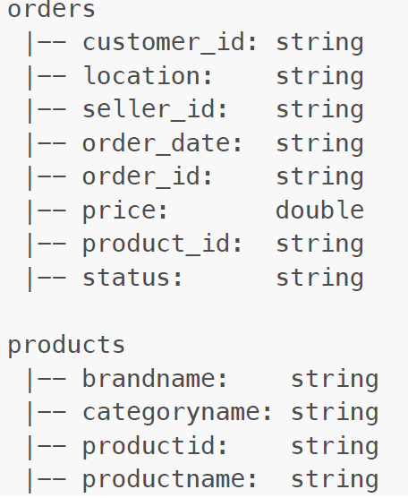

# spark-analytic-jobs
In this project, where you can test your data engineering skills, you will deal with problems that include the
following jobs:
 - Batch Processing
 - Stream Processing
 - DevOps

The diagram above shows an end-to-end Data Pipeline. Here are Data Producer, Kafka, Flink and Spark
applications. 
What was implemented:
   - Batch Spark application(s) with data in file system.
   - Flink application using Kafka topics which is the DataProducer application writes data.
   - Dockerized all applications and provide a single command (script or docker-compose up) which runs
     all applications.
   - In project is using Scala.

**Problem Details**
**Data** 
You will work on orders and products data.  
Here are their schemas: 

 
